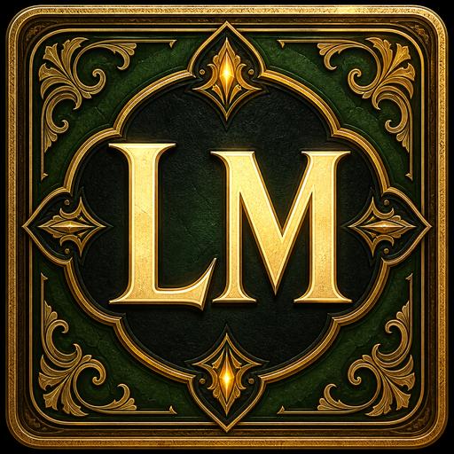

# Levemetes for Dalamud



A small, fully local challenge-card game for Final Fantasy XIV. It uses native Dalamud/ImGui UI, stores decks in the plugin configuration directory, and has no server, telemetry, or web app.

## Features

- Assign one or more of SFW, Mixed, NSFW, and NSFW+ to each card, then choose a play category and draw without replacement from its filtered, shuffled pile.
- Category-colored card labels and text: green, yellow, light red, and dark red respectively.
- Multi-category cards use individually colored headings and an evenly segmented multicolor border.
- Revealed cards use a padded, double-line celestial-gold inner frame with chamfered corners and diamond accents.
- Optional BLIND VOLUNTEER, CHOICE, and RANDOM card keywords.
- Required levemete-style titles and six activity types: Action (Self), Action (Other-Volunteer), Action (Choice), Action (Random), Revelation (Thought), and Revelation (Experience).
- Activity type and artwork are selected independently for every card.
- Includes 24 original selectable artwork scenes: six each under SFW, MIXED, NSFW, and NSFW+.
- Import personal PNG, JPEG, BMP, or GIF artwork in the card editor. Images are automatically center-cropped and resized to an efficient 768×512 JPEG.
- Six original embedded portrait card-face templates, one for every activity type. Runtime title, classification, keyword, and instruction text is overlaid into each template's reserved parchment regions.
- A concealed deck using the supplied celestial-tree card-back image until a card is drawn.
- A clipboard button for copying a drawn card's text before optionally pasting it into chat.
- Add, edit, and delete cards in game.
- Format card text with bold, italic, underline, and individually centered lines, including combined styles.
- Add optional flavor text that appears separately at the bottom of a drawn card.
- Create, rename, switch between, and delete multiple decks.
- Add an optional deck author, shown beside the selected deck name and carried with shared deck bundles.
- Automatic local JSON persistence with a starter deck on first launch.
- Import portable `.levemetesdeck` bundles (or legacy JSON decks) with a file browser, either as a new deck or merged into an existing deck with duplicate cards and images skipped.
- Export a deck and its custom artwork together as one shareable `.levemetesdeck` file.
- Open the most recent export folder directly from the folder button beside the export control.
- Input limits, format-version checks, duplicate-ID repair, safe replacement saves, delete confirmations, and visible error messages.

Draw state is session-only. Deck contents persist, but the draw pile resets when the plugin reloads or a deck changes.

## Requirements

- Windows with Final Fantasy XIV, XIVLauncher, and Dalamud.
- Visual Studio 2026 or another IDE that supports the .NET 10 SDK.
- .NET 10 SDK.
- Internet access for the first package restore.

This project targets **Dalamud API 15** using `Dalamud.NET.Sdk/15.0.0` and .NET 10, matching the current release conventions as of August 2026.

## Build

1. Open `TruthOrDare.slnx` in Visual Studio, or open a terminal in this directory.
2. Restore and build:

   ```powershell
   dotnet restore
   dotnet build -c Debug
   ```

3. The development plugin will be produced under `TruthOrDare/bin/x64/Debug/` (the SDK may add a `publish` subdirectory depending on its version). Locate `Levemetes.dll` there.

Before publishing, replace the placeholder project URL in `TruthOrDare/TruthOrDare.csproj`.

## Install for local development

1. Launch the game through XIVLauncher.
2. Open Dalamud Settings with `/xlsettings`.
3. Enable plugin development/testing options if needed.
4. Under **Experimental → Dev Plugin Locations**, add the full path to the built `Levemetes.dll` (or its containing output directory).
5. Open `/xlplugins`, find the plugin under developer plugins, and enable it.
6. Use `/levemetes` to open the window. The plugin installer’s main/configuration buttons also open it.

After rebuilding, use Dalamud’s developer plugin reload control or restart the game.

## Deck files and sharing

Live decks are stored under Dalamud’s per-plugin configuration folder in `decks/`. The exact path is displayed on the **Decks & Sharing** tab.

For sharing, enter a bundle path and choose **Export Selected**, then send the resulting `.levemetesdeck` file outside the game. The bundle contains `deck.json` plus only that deck's custom images; the 24 built-in images are already supplied by the plugin. Another player can use **Import as New Deck...** and select it in the file browser. Imported decks receive new internal IDs, so they do not overwrite an existing deck.

Use **Add Custom Image...** beside the Artwork selector to add personal artwork. Levemetes validates the file, center-crops it to the card's artwork shape, resizes it to 768×512, and stores an optimized local JPEG. The preview shows the same visible crop used by a drawn card. An unused custom image can be removed from the editor; images still assigned to cards are protected from accidental removal.

To combine decks, select the destination deck and choose **Merge into Selected...**. Cards that match an existing card's title, activity type, artwork content, categories, optional keyword, and text are skipped; capitalization and extra whitespace do not create false differences. Identical custom images are reused, and new cards and artwork receive fresh internal IDs.

The card editor includes **Bold**, **Italic**, **Underline**, and **Center Line** buttons. Each button inserts a short editable example using `[b]`, `[i]`, `[u]`, or `[c]` tags. Replace the example words with the text you want formatted. Tags may be nested to combine styles. A `[c]...[/c]` section is centered independently without centering the rest of the card. The tags are rendered as formatting on the card and removed when **Copy Text of Card** is used.

Each card may also have optional flavor text. Flavor text is displayed as a separate centered, italic section in the final two or three lines at the bottom of the card. **Copy Text of Card** copies only the playable card text and deliberately excludes the flavor text.

Example deck format:

```json
{
  "FormatVersion": 8,
  "Id": "92310d1a-3255-4dd0-ab1d-51007a1a5812",
  "Name": "Example Deck",
  "Author": "Example Creator",
  "Cards": [
    {
      "Id": "cdf69327-51b8-4731-9088-acba915551db",
      "Title": "A Matter of Perspective",
      "Activity": "RevelationThought",
      "Category": "Sfw, Mixed",
      "Keyword": "Choice",
      "Text": "Example card text"
    },
    {
      "Id": "bbb0f52c-9f10-49c8-b1d8-b59d11c9e2fa",
      "Title": "Lend a Hand",
      "Activity": "ActionOtherVolunteer",
      "Category": "Mixed",
      "Keyword": null,
      "Text": "Another example card"
    }
  ]
}
```

Deck names and optional author names are limited to 80 characters, card text to 1,000 characters, flavor text to 240 characters, and decks to 5,000 cards and 200 custom images. Source images are limited to 25 MB and bundles to 100 MB. Bundle contents are validated and never extracted by their supplied paths. Import only files you trust and review their text before playing.

## Privacy and scope

Everything happens on the local client. The plugin does not synchronize players, post to chat, read game state, or contact a network service. Players coordinate turns and share exported files themselves.

## License

MIT for the plugin source. The six activity templates are original generated placeholders and can be replaced later without changing deck data. The bundled `card-back.jpg` is the user-specified image from `eternalstarco.carrd.co`; confirm that you have permission to redistribute it before publishing the plugin. No Final Fantasy XIV visual assets are included.

## Submission note

Dalamud’s official repository has contribution and AI-usage policies beyond merely compiling successfully. Review the current policies and perform a human code review and play test before any submission.
